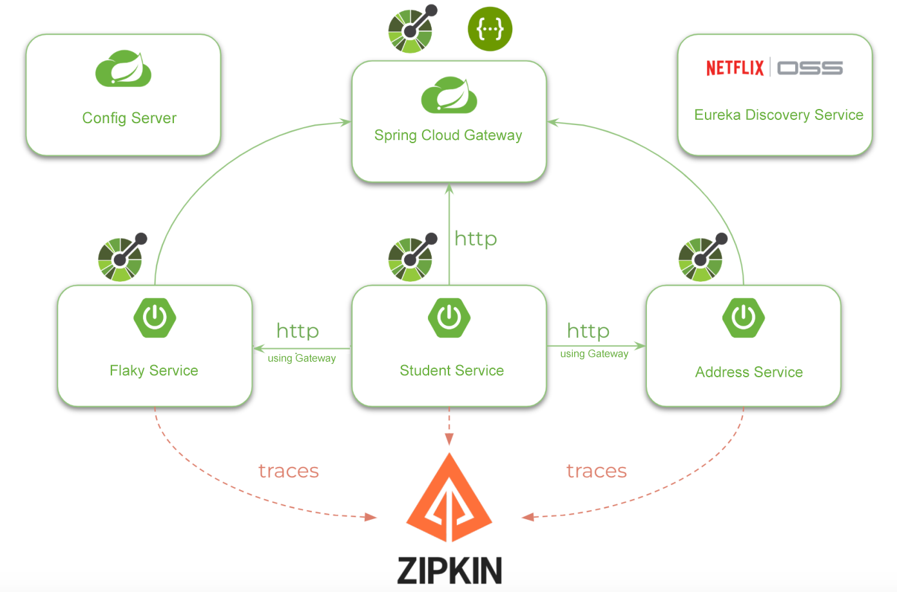
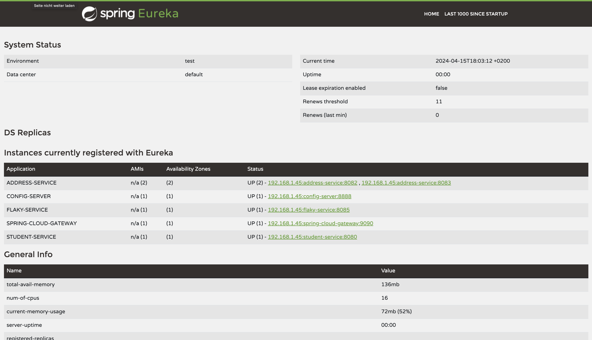
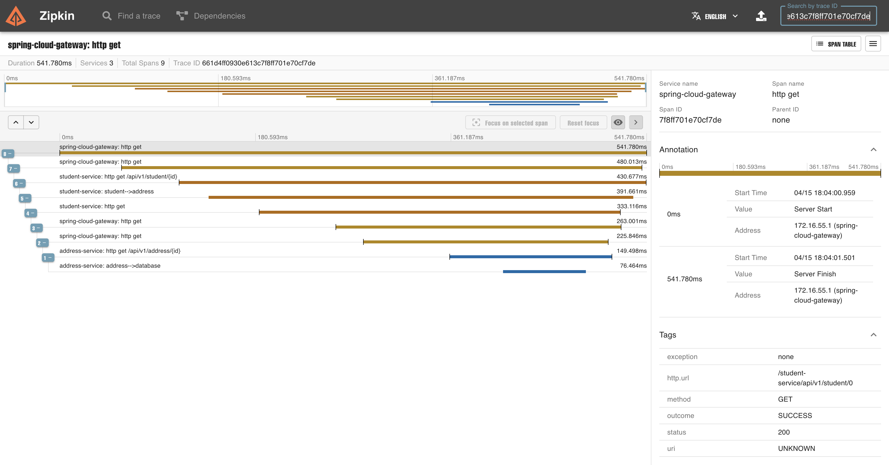

# Spring Resilience Demo v1.2

(EUREKA, SPRING CLOUD CONFIG SERVER, SPRING CLOUD GATEWAY, CIRCUIT BREAKER, ACTUATORS, MICROMETER, ZIPKIN, FEIGN, 
RESILIENCE4J)

## Setup
- you can run PostgreSQL using the docker-compose.yaml
- Additional Databases (addresses, students) are created on first postgres startup

PostgreSQL, PGAdmin and Zipkin is started using docker compose up -d
PGAdmin: Register DB-Server using hostname: postgresql-service, user:postgres, password:password
Eurka-Server: Loginto Eureka using user:eureka password:password

## Run Environment

Services:
- Eureka Service as Microservice and Gateway Registry
- Spring Cloud Config Server using https://github.com/andrlange/spring-resilience.git path=config
- Spring Cloud Gateway for routing and load balancing (Actuators, Zipkin and Micrometer)
- Student-Service (resilience4j, Spring AOP, Circuit Breaker, Feign Client, Actuators, Zipkin and Micrometer, Retry, 
  Bulkhead)
- Address-Service (Actuators, Zipkin and Micrometer, RateLimiter)
- Flaky-Service (Actuators, Zipkin and Micrometer) returns Randomly Courses

application.properties will show you the configuration of used Spring Components

Start order:
- Eureka Server
- Config Server
- Spring Cloud Gateway
- Student Service & Address Service
- Flaky Service

Note: to run multiple services for each, just export PORT=80xx to your environment and start multiple student or 
address microservices on different ports.

## URLs
- Eureka > http://localhost:8761
- Zipkin > http://localhost:9411
- Student using the Gateway: http://localhost:9090/student-service/api/v1/student/0
- Student retries: http://localhost:9090/student-service/api/v1/flaky/code/BIO
- PGAdmin: http://localhost:5555

After all Services are started:

Example on calling student/0 and searching the traceId in Zipkin

(Maintainer: Andreas Lange)