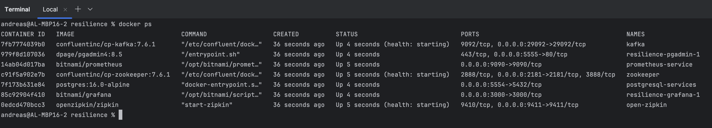

# Spring Resilience Demo

(EUREKA, SPRING CLOUD CONFIG SERVER, SPRING CLOUD GATEWAY, CIRCUIT BREAKER, ACTUATORS, MICROMETER, ZIPKIN, FEIGN, 
RESILIENCE4J, KAFKA)

Microservice Communication via REST/API & KAFKA

#### Powered by: Spring Boot 3.4.2 and Spring Cloud 2024.0.0


***

# Covered Topics

## Microservice Ecosystem

- Eureka Service Discovery (Using 2 Instances Replication)
- Config Server
- Spring Cloud Gateway (Using Redis for RateLimiter)
- Provided microservices to jumpstart testing

## Distributed Tracing

- Spring Boot Actuators
- Micrometer (former Sleuth)
- Zipkin for HTTP & KAFKA 

## Resilience4J

- Circuit Breaker
- Bulkhead
- Retry
- Rate Limiter
- Time Limiter

## App Monitoring

- Actuator Integration with Prometheus
- Grafana Dashboards (Standard metrics and resilience4j metrics)

***

## The Demo Setup


## Setup
- you can run PostgreSQL, PGAdmin, Zipkin, Zookeeper, Kafka, Redis, Prometheus and Grafana using the docker-compose.yaml
- Additional Databases (addresses, students) are created on first postgres startup

PostgreSQL, PGAdmin and Zipkin is started using docker compose up -d
PGAdmin: Register DB-Server using hostname: postgresql-service, user:postgres, password:password
Eurka-Server: Log into Eureka using user:eureka password:password

## Run Environment

Services:
- Eureka Service as Microservice and Gateway Registry
- Spring Cloud Config Server using https://github.com/andrlange/spring-resilience.git path=config
- Spring Cloud Gateway for routing and load balancing (Actuators, Zipkin and Micrometer)
- Student-Service (resilience4j, Spring AOP, Circuit Breaker, Feign Client, Actuators, Zipkin and Micrometer, Retry, 
  Bulkhead, TimeLimiter)
- Address-Service (Actuators, Zipkin and Micrometer, RateLimiter)
- Flaky-Service (Actuators, Zipkin and Micrometer) returns Randomly Courses

application.properties will show you the configuration of used Spring Components

Start order:
- Eureka Server
- Config Server
- Spring Cloud Gateway
- Flaky Service & Student Service & Address Service


Note: to run multiple services for each, just export PORT=80xx to your environment and start multiple student or 
address microservices on different ports.

## URLs
- Eureka : http://eureka1:8761 & http://eureka2:8762
- Zipkin : http://localhost:9411
- PGAdmin: http://localhost:5555
- Prometheus: http://localhost:9090
- Grafana: http://localhost:3000
- Student Service using the Gateway: http://localhost:9000/student-service/api/v1/student/0
- Address Service using the Gateway: http://localhost:9000/address-service/api/v1/address/0
- Flaky Service using the Gateway: http://localhost:9000/address-service/flaky/version

***

## Prepare Eureka Service Discovery with Replication
To run eureka with replication between instances on the same host requires to configure two hostnames on the same IP 
Address.

Configure your /etc/hosts for Mac or Linux and C:\Windows\System32\Drivers\etc\hosts for Windows:
```shell
127.0.0.1 localhost eureka1 eureka2
```

Both instances can run on the same host using two different hostnames.

## Start the Service Discovery
Start the eureka server by changing to the eureka folders and run:
- eureka-server
- eureka-server-ha

```bash
mvn spring-boot:run
```


You should be able to open the UI of Eureka http://eureka:8761 and http://eureka2:8762


Username: eureka Password: password


You should see two replicated instances: EUREKA-SERVER
and on each site one available-replicas: example -  http://eureka2:8762/eureka/

***

## Start the Config Server

use the config server folder config-server to start:

```bash
mvn spring-boot:run
```

The configuration will be propagated out of this repo /config

Now you should be able to crawl the microservice configs e.g. using a browser, postman or curl:
http://localhost:8888/spring-cloud-gateway/dev

You should now receive the following config:


## Run Containers such as DB, Zipkin etc.
Run PostgreSQL, PG-Admin, Zipkin Server, Zookeper, Kafka, Prometheus and Grafana

To run all the services you can just use the docker-compose.yaml file to start all services.

```bash
docker compose up -d
docker ps
```

now you should see the following running containers:



make sure all containers are up, so you can access all the services later.

***

## Starting Microservices

Start all microservices (Student Service, Flaky Service and Address Service)
```bash
# Executed in each folder
mvn spring-boot:run
```


We also started a Prometheus and Grafana Service using our docker-compose.yaml, so we have Prometheus and Grafana
Service running already.
check prometheus target status to see if prometheus can reach our services:
- http://localhost:9090/targets


***

### Connecting Prometheus Datasource
Grafana needs to connect to Prometheus to collect all data and let them be used by the dashboards.

Grafana UI:
- http://localhost:3000 Username:admin Password:password

Steps:
- goto: Home/Connections/Data Sources > add new Data Source
- select Prometheus
- you only need to provide its url: http://prometheus-service:9090
  - in this case we are using the internal container network to resolve the container network ip using its service name
- save & test the connection


Importing our first Spring Boot Dashboard:

Steps:
- goto: Home/Dashboards/new > import
- select the dashboard: dashboards/springboot.json
- select the new created datasource: prometheus
- and import

You should see a Spring Boot Dashboard showing metrics from flaky-service (Instance:host.docker.internal:8085)


***

## Kafka & Microservices

We use the embedded Kafka integration to demonstrate distributed tracing using kafka topics instead of REST/HTTP.

Student Service provides a News-Message REST endpoint to send messages to the Address Service

Use:
```
curl -i -X POST localhost:9000/student-service/api/v1/news \
  -H 'Content-Type: application/json' \
  -d '{"title":"Article about Spring Cloud Stream and Kafka"}'
```
to send a message:

curl >> (REST) >> Spring Cloud Gateway >> (REST) >> Student Service >> [news-out-0] (CLOUD MESSAGING) [news-in-0] >>
Address Service

The Address Service retrieves the message:


### Distributed Tracing using Zipkin for Microservice Communication using Kafka Cloud Messaging

We only needed to add the Kafka observation to our configuration, so tracing over cloud messaging will be enabled.

Added this to our configuration (producer, consumer)
```properties
spring.cloud.stream.kafka.binder.enable-observation=true
```

Now we can see the distributed tracing using Zipkin (use the traceId):


***

## Resilience4J - Retry

Calling the endpoint
- http://localhost:9000/student-service/api/v1/flaky/code/BIO

several times creates random responses on the amount of retires. In average the Flaky Service produces 50% of
failures (HTTP:500).

It can happen also, that Flaky Service fails 4 times in a row, so the Retry will break and come up with a final error.

Retry example 3 attempts:

we can see three retries logged in the Student Service log output

Result:


Using Zipkin we can see all 3 attempts and trace down the overall response time


Failed Attempt: In this example 4 Flaky Service calls in row occurred, so the retry stopped after 3 attempts.
Retry example failure:

we can see three retries and failing logged in the Student Service log output

Result:


Using Zipkin we can see all attempts and trace down the overall response time until HTTP:500 shows up


***

## Resilience4J - Rate Limiter

Now we can call Address Service.
- http://localhost:9000/address-service/api/v1/address/1

If we now call the same API endpoint more than 5 times in less than 15 seconds, the Rate Limiter will stall the
response for the configured time (5s) and return in our case a NULL Object.

The Address Service log shows the call sequence and the limiting:


The response will provide a HTTP:429 Error and a Fall-Back Object (NULL)


### RateLimiter using Spring Cloud Gateway

Now we used RateLimiter with Resilience4J in our Microservice we will use RateLimiter as a Cross Cutting Concern in 
our Spring Cloud Gateway:

/config/spring-cloud-gatway-dev.yaml
```yaml
spring:
  lifecycle:
    timeout-per-shutdown-phase: 5s
  redis:
    host: localhost
    port: 6379
  cloud:
    gateway:
      discovery:
        locator:
          lower-case-service-id: true
          enabled: true
      default-filters:
        - name: RequestRateLimiter
          args:
            redis-rate-limiter:
              replenishRate: 10
              burstCapacity: 20
              requestToken: 1
      routes:
      - id: flaky-service
        uri: lb://flaky-service
        predicates:
        - Path=/flaky/books/**
```
This configuration adds a global default filter (RateLimiter) based on Redis with 10 calls/s and peak 20 
calls/s.

We use ab to check the Gateway based Ratelimiter:
```shell
andreas@AL-MBP16-2 resilience % ab -n 21 -c 21 http://localhost:9000/flaky-service/flaky/books
This is ApacheBench, Version 2.3 <$Revision: 1903618 $>
Copyright 1996 Adam Twiss, Zeus Technology Ltd, http://www.zeustech.net/
Licensed to The Apache Software Foundation, http://www.apache.org/

Benchmarking localhost (be patient).....done


Server Software:        
Server Hostname:        localhost
Server Port:            9000

Document Path:          /flaky-service/flaky/books
Document Length:        86 bytes

Concurrency Level:      21
Time taken for tests:   0.043 seconds
Complete requests:      21
Failed requests:        1
   (Connect: 0, Receive: 0, Length: 1, Exceptions: 0)
Non-2xx responses:      1
Total transferred:      7066 bytes
HTML transferred:       1720 bytes
Requests per second:    493.46 [#/sec] (mean)
Time per request:       42.557 [ms] (mean)
Time per request:       2.027 [ms] (mean, across all concurrent requests)
Transfer rate:          162.14 [Kbytes/sec] received

Connection Times (ms)
              min  mean[+/-sd] median   max
Connect:        0    1   0.3      1       1
Processing:     9   19   6.7     18      30
Waiting:        8   18   6.7     17      30
Total:          9   19   6.6     18      30

Percentage of the requests served within a certain time (ms)
  50%     18
  66%     22
  75%     25
  80%     26
  90%     28
  95%     29
  98%     30
  99%     30
 100%     30 (longest request)

```
we can see the 21st call was dropped as failed call.

Because we allow to response the Gateway with limiter header the output of a single request looks like:

```bash
http :9000/flaky-service/flaky/books
HTTP/1.1 200 OK
Content-Type: application/json
Date: Wed, 01 May 2024 12:20:45 GMT
X-RateLimit-Burst-Capacity: 20
X-RateLimit-Remaining: 19
X-RateLimit-Replenish-Rate: 10
X-RateLimit-Requested-Tokens: 1
transfer-encoding: chunked

[
    {
        "title": "Lord of the Rings"
    },
    {
        "title": "Hobbit"
    },
    {
        "title": "Silmarillion"
    }
]
```

Each independent client get its own bucket on redis and can use the configured amount of tokens per second.

***

## Resilience4J - Bulkhead

In this example we are using Apache ab to create 5 concurrent calls:
- http://localhost:9000/student-service/api/v1/student


The Student Service log:


***

## Resilience4J - Circuit Breaker

We can call the endpoints for testing:
- http://localhost:9000/student-service/api/v1/student/0

As long the Address Service is up, and we don't have more than 50% failing calls (10 Calls min.), the Circuit Breaker
stays CLOSED.

Check the Actuator:
- http://localhost:9000/student-service/actuator/health


As soon we stop the Address Service and we have 50% failed calls out of ten, the Service Breaker changes to OPEN state.


After the configured time (10s) the Circuit Breaker will switch to HALF-OPEN to try to recover the CLOSE state.


As soon we stay on responsive calls the Circuit Breaker will change again to CLOSED state.


***


## Resilience4J - Time Limiter

To use TimeLimiter we want to call a very slow API endpoint. The /version endpoint of Flaky Servie will take 5
seconds to return.

- http://localhost:9000/flaky-service/flaky/version

The Student Service will provide access to the FlakyService Version endpoint through:

- http://localhost:9000/student-service/api/v1/flaky/version

Student Service log


Calling the Flaky Service Version endpoint


Student Service response calling the Flaky Service Version endpoint


***


## Finally we will add a Resilience4J Dashboard to Grafana

Like before we will add a Dashboard. Execute the same steps to import dashboards/resilience.json
Hint!: Just remember to chose prometheus as data source.


***

Finally, you should be able to track Resilience4J Metrics and visualize it in Grafana:


## Addendum

You can find this Demo as Hands-On Step-By-Step here: https://github.com/andrlange/spring-resilience-handson

Don't forget to stop all Services and:
```bash
docker compose down
```

***

### Aspect order
The Resilience4J Aspects order is the following:
```text
Retry ( CircuitBreaker ( RateLimiter ( TimeLimiter ( Bulkhead ( Function ) ) ) ) )
```
so Retry is applied at the end (if needed).
If you need a different order, you must use the functional chaining style instead of the Spring annotations style or explicitly set aspect order using the following properties:

```text
- resilience4j.retry.retryAspectOrder
- resilience4j.circuitbreaker.circuitBreakerAspectOrder
- resilience4j.ratelimiter.rateLimiterAspectOrder
- resilience4j.timelimiter.timeLimiterAspectOrder
- resilience4j.bulkhead.bulkheadAspectOrder
```
